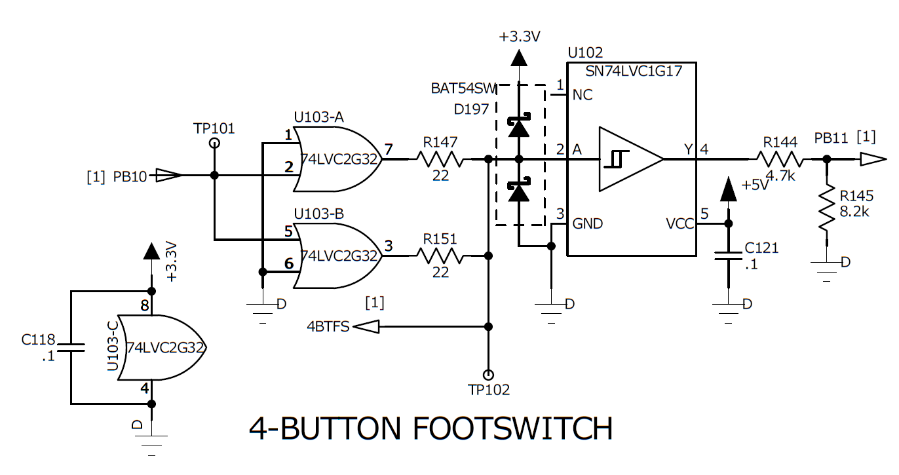

# Communication protocol for Fender foot switch (MS-4) and expression (EXP-1) pedals

## Introduction

I am in the process of building myself a guitar amp, and I thought it would be nice if I could switch the amp's on-board effects with a foot switch and change parameters with an expression pedal.

I also have a Fender Mustang III with its 4 button foot switch (MS-4) and the expression pedal (EXP-1). So I though I might reverse engineer their communication protocol and use them on my amp in the making.

So this is the result of my little adventure.

[Fender claims](https://tone-support.fender.com/hc/en-us/articles/115003535766) that the 4 button foot switches for previous versions of their modeling amps (G-DEC 30 (ULT-4) and Mustang III, IV and V (MS-4)) are compatible with Mustang GT (MGT-4), meaning you can use the older foot switches with the Mustang GT amps. I don't know if this means that this protocol description also applies to these other foot switch pedals, but I strongly suspect it does at least in part.

Fender's latest range of modeling amplifiers (Mustang GTX) also has a new foot switch pedal (GTX-7). It has 7 buttons (instead of only 4 on the older ones), but it has the same cable, the same number of individual LEDs (8) and the same 3 digit 7 segment LED display. I can't be sure until I test it, but I have a strong feeling that the protocol for GTX-7 is an extension of the protocol described here.

This description does not apply to Fender's 2 button foot switches.

## Hardware

The MS-4 and/or EXP-1 are connected to the amp with a standard 1/4 inch mono jack and cable. The sleeve of the jack is connected to the ground, and the tip powers the pedals (3.3V) and also carries the data between the pedals and the amp. The following image shows the relevant part of the amp's circuit which is responsible for interfacing with the pedals:

The main thing here are the two OR logic gates connected in parallel. 74LVC2G32 can output 50mA per channel, which is a little more than usual for a logic gate, and I am guessing that is the reason why they chose it. Connecting them in parallel allows the pedals to be powered by up to 100mA. The tip of the jack is connected to 4BTFS. There is also a Schmitt trigger (SN74LVC1G17) which clears up the noise coming in through the cable that the pedals are connected to. I have no idea why they are powering the Schmitt trigger with 5V and then dropping its output with the voltage divider to around 3.3V. Your guess is as good as mine.

PB10 is connected to the TX pin, and PB11 to the RX pin of the microcontroller.

## Communication

The amp and the pedals communicate over a USART bus clocked at 31250 baud which seems to be the standard MIDI baud rate.

Because there is only one line for both TX and RX, everything that a sender transmits over TX will also be seen on its RX. Therefore, the software of the transmitter must ignore one byte received on RX for every byte transmitted on TX to maintain synchronization.

## Protocol

The protocol consists of several kinds of messages transmitted from a pedal to the amp or vice versa. Every message begins with a command byte followed by several bytes of payload, and a single byte checksum. The command byte always has its high order bit set, while the payload bytes and checksum have the high order bit cleared. This is how you can recognize the beginning of a new message. The checksum is calculated by XOR-ing all the bytes of the payload. A message must be acknowledged by the receiver with an ACK byte (0xFD) or an error byte (0xFE) in case of bad checksum. The following lists all command bytes and their meanings:

| command | description
|---------|-------------
| F8      | LED message
| FA      | Double button message
| FB      | Expression pedal position message
| FC      | Button message
| FD      | Pedal init message

## Messages

| message            | direction    | length | example
|--------------------|--------------|--------|---------
| MS-4 init          | pedal -> amp |      4 | FD 08 03 0B
| EXP-1 init         | pedal -> amp |      4 | FD 0C 01 0D
| MS-4 button        | pedal -> amp |      5 | FC 08 7D 7D 08
| MS-4 double button | pedal -> amp |      7 | FA 08 7F 7C 7F 7D 09
| EXP-1 button       | pedal -> amp |      5 | FC 0C 7C 00 70
| EXP-1 position     | pedal -> amp |      6 | FB 0C 60 30 62 3E
| MS-4 LEDs          | amp -> pedal |      9 | F8 08 70 24 79 18 38 00 05
| MS-4 display       | amp -> pedal |      9 | F8 08 72 00 74 5F 76 14 33
| EXP-1 LEDs         | amp -> pedal |      9 | F8 0C 70 20 79 18 38 00 05

The second byte of the message identifies the pedal: 0x08 for MS-4, 0x0C for EXP-1.

### Init message

The init messages are sent by the pedal to the amp when the pedal is powered up. It lets the amp know that a pedal has been plugged in. Init messages are constant: none of the payload bytes in them change. I suspect the 0x03 in the MS-4 init message signifies the version of the foot switch firmware. When my foot switch is turned on it displays "u-3" which could mean V3 or version 3. But this is just a guess.

### Button message

These notify the amp that the state of a button has been changed. The payload begins with a pedal ID (0x08 or 0x0C). The following 2 bytes identify the button and if the button was pressed or released. The following table lists the possible combinations:

| event | pedal | description
|-------|-------|-------------
| 7D 7C | MS-4  | button 4 was pressed (QA3)
| 7D 7D | MS-4  | button 3 was pressed (QA2)
| 7D 7E | MS-4  | button 2 was pressed (QA1)
| 7D 7F | MS-4  | button 1 was pressed (Mode/Tuner)
| 7F 7C | MS-4  | button 4 was released (QA3)
| 7F 7D | MS-4  | button 3 was released (QA2)
| 7F 7E | MS-4  | button 2 was released (QA1)
| 7F 7F | MS-4  | button 1 was released (Mode/Tuner)
| 7C 00 | EXP-1 | button was pressed
| 7E 00 | EXP-1 | button was released

### Double button message

This message notifies the amp that the state of two buttons of MS-4 has changed. It is only sent when buttons have been pressed or released at the same time (more or less). I suspect this can be used by the amp to handle the situation when the user steps on two buttons at once. It is a bit tricky to trigger, your foot has to be very flat on the buttons to achieve this.

The first byte of the payload is the usual pedal ID (0x08) and the next 4 bytes are split in 2 groups of 2 bytes each. The significance of these is the same as with the normal single button message.

Example: FA 08 7F 7C 7F 7D 09

FA 08 are the command byte and the foot switch ID, 7F 7C means button 4 was released and 7F 7D means button 3 was released. 09 is the checksum.

### Expression pedal position message

This notifies the amp that the position of the rocker on the expression pedal has changed. Byte 3 of the message is constant (0x60) and bytes 4 and 5 encode the position of the rocker. Since only the lower 7 bits in a payload byte can be used, these two bytes form a 14 bit value. For instance, if bytes 4 and 5 are 0x30 and 0x62, the rocker position will be 0x1862. This value is the raw uncalibrated position. On my EXP-1 pedal, it ranges from 0x17FE to 0x3993.

### LED messages

These are sent from the amp to the pedal to update the state of the LEDs and the 3 character display on the foot switch pedal. The payload starts with the usual pedal identifier (0x08 or 0x0C) which is followed by 6 bytes grouped into 3 groups of 2 bytes each. Bit 1 though 6 of the first byte in each group signify which LEDs will be changed (the selector of the LEDs), while the least significant bit of the first byte and the lower 7 bits of the second byte hold the new values for the selected LEDs.

| byte 1 (selector) | byte 2 (value) | description
|-------------------|----------------|-------------
| 0zzz zzzy         | 0yyy yyyy      | z: bits of the LED group selector, y: new on/off states for this LED group. |

The LEDs selector values:

| selector | description
|----------|-------------
| 0x70     | single LEDs on MS-4 and EXP-1
| 0x72     | first digit on MS-4 display
| 0x74     | second digit on MS-4 display
| 0x76     | third digit on MS-4 display

The following table shows which bit of the selector and value bytes maps to which LEDs for group selector 0x70 (individual LEDs):

| bit | byte     | pedal | LED
|-----|----------|-------|-----
| 0   | value    | MS-4  | the red LED above button 4 (QA3)
| 1   | value    | MS-4  | the yellow LED for mode 3
| 2   | value    | MS-4  | the red LED above button 3 (QA2)
| 3   | value    | MS-4  | the green LED between the 3 number display and the Fender logo
| 4   | value    | MS-4  | the red LED above button 2 (QA1)
| 5   | value    | MS-4  | the red LED for mode 1
| 6   | value    | MS-4  | the red LED above button 2 (mode/tuner)
| 0   | selector | MS-4  | the green LED for mode 2
| 3   | value    | EXP-1 | the lower (green) LED
| 5   | value    | EXP-1 | the upper (red) LED

The following table shows which bit of the group and value bytes maps to which LEDs for group selectors 0x72, 0x74 and 0x76 (display LEDs):

| bit | byte     | pedal | LED on 7 segment display
|-----|----------|-------|--------------------------
| 0   | value    | MS-4  | vertical upper left
| 1   | value    | MS-4  | horizontal upper
| 2   | value    | MS-4  | vertical upper right
| 3   | value    | MS-4  | vertical lower left
| 4   | value    | MS-4  | vertical lower right
| 5   | value    | MS-4  | decimal dot
| 6   | value    | MS-4  | horizontal lower
| 0   | selector | MS-4  | horizontal middle

Examples:

Message: F8 08 72 00 74 5F 76 14 33

The first two bytes are the command byte (0xF8) and the pedal selector (0x08). Bytes 3 and 4 are the LEDs selector 0x72 (first digit on display) and 0x00 (all LEDs off). Bytes 5 and 6 are the LEDs selector 0x74 (second digit on display) and 0x5f (number 0). Bytes 7 and 8 are 0x76 (third digit on display) and 0x14 (number 1). The last byte is the checksum (0x33).

Message: F8 08 71 00 79 18 38 00 20

The first two bytes are the command byte (0xF8) and the pedal selector (0x08). Bytes 3 and 4 are the LEDs selector 0x71 (first digit on display + mode 2 led is on) and 0x00 (all LEDs off). The rest of the message contains 4 bytes (0x79, 0x18, 0x38, 0x00) and a checksum. These 4 bytes don't seem to hold any significance that I can uncover. It could be leftover from a previous version of the protocol or just padding. I tried changing these to zeros, and the message was accepted by the pedal.

## Implementation

This repository also contains source code for an implementation of a C++ class which can be used to communicate with these pedals. It is written on an AVR128DA48 Curiosity Nano dev board.

Enjoy!
